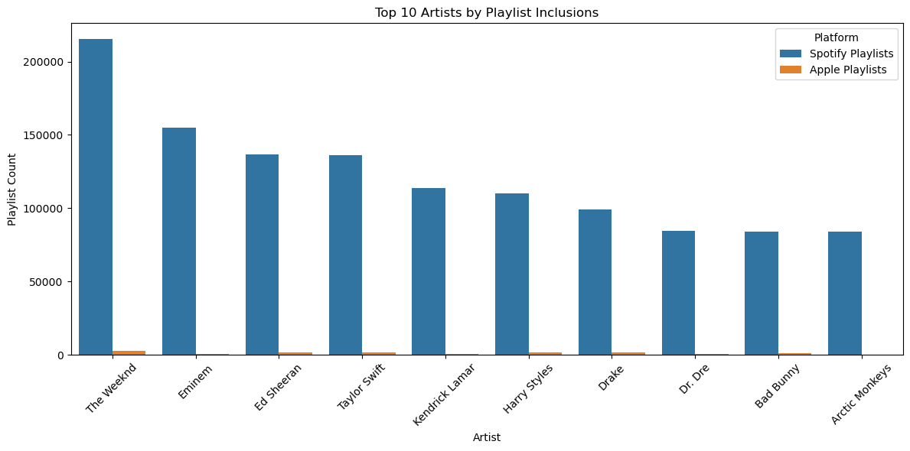

# Artist Playlist Data Analysis
In this Portion contains the artists playlists with how many songs added and how many Artists are unique

## Objective:
- The Objective of this is to see how many songs are added per month
- How many Unique Artists there are per month

### Explanation:
 To do this i started by loading the data and and made a copy of the dataframe
```python
import pandas as pd
from datasets import load_dataset
import seaborn as sns
import matplotlib.pyplot as plt

df = pd.read_csv('D:\python practice/Data Analytics/Real Dataset Practice/Spotify customers/spotify-2023.csv',encoding='latin1')

df_t = df.copy()
df_t
```
I used the dropna() method to remove everything expect the things listed in the subset.Then  i converted the released year , month ,day to integer datatype.

```python
df_t = df_t.dropna(subset=['released_year','released_month','released_day'])

#converting released years to integer datatype
df_t['released_year'] = df_t['released_year'].astype(int)
df_t['released_month'] = df_t['released_month'].astype(int)
df_t['released_day'] = df_t['released_day'].astype(int)

```
I checked that the year month and day is showing or not.In addition to that I used the datetime method() in pandas to convert it into datetime,I only wanted the month values so i used the method of period to select the month only

```python
print(df_t[['released_year', 'released_month', 'released_day']].head())

df_t['release_date'] = pd.to_datetime({
    'year': df_t['released_year'],
    'month': df_t['released_month'],
    'day': df_t['released_day']
})

df_t['month'] = df_t['release_date'].dt.to_period('M')
df_t = df_t[df_t['release_date'].dt.year == 2023]  # Filter to just year 2023

```

After grouping the data and adding the agg method i then added the melt method to make it for plotting

```python
monthly_summary = df_t.groupby('month').agg({
    'artist(s)_name': pd.Series.nunique,
    'track_name' : 'count'
}).rename(columns={
    'artist(s)_name': 'Unique Artists',
    'track_name': 'Songs Added'
}).reset_index()

monthly_summary.columns = ['Month', 'Unique Artists', 'Songs Added']    
monthly_summary['Month'] = monthly_summary['Month'].astype(str)

monthly_melted = monthly_summary.melt(id_vars='Month', var_name='Metric', value_name='Count')

# Now plotting the the graph
sns.barplot(data=monthly_melted, x='Month', y='Count', hue='Metric')
```

### Result:

#
# 🎧 Spotify 2023 Data Analysis

This project Contains dataset of spotify artist and how their music are trending what are the names of the artist and other things.

---

## Project Objective:
- The Objective is that which artist has the highest track from top 10 artists.

### Explanation:
I started by loading the data and accessing the data

```python
import pandas as pd
import matplotlib.pyplot as plt
from datasets import load_dataset
import seaborn as sns

df = pd.read_csv('D:\python practice/Data Analytics/Real Dataset Practice/Spotify customers/spotify-2023.csv',encoding='latin1')
```

Then i used a copy method so that it does not effect the orginal data frame:
```python
df_t = df.copy()
```

I Use the str split() method to split the string
```python
df_t['artist(s)_name'] = df_t['artist(s)_name'].str.split(',')
```

Used Explode() method to explode the artist_name column and then run the value_counts() and reseted the index.
```python
top_artist = df_t['artist(s)_name'].value_counts().reset_index()
top_artist.columns = ['Artist','number of tracks']
```

I used groupby() method and grouped it by artist name and added an agg method.At last i used the melt method so that it becomes Easy to plot the graph.

```python
    artist_stats = df_t.groupby('artist(s)_name').agg({
    'track_name' : 'count',
    'in_spotify_playlists' : 'sum',
    'in_apple_playlists':'sum'
}).reset_index()

artist_stats.columns = ['Artist', 'Number of Tracks', 'Spotify Playlists', 'Apple Playlists']

top_by_playlist = artist_stats.sort_values(by='Spotify Playlists', ascending=False).head(10)


melted = top_by_playlist.melt(
    id_vars='Artist', 
    value_vars=['Spotify Playlists', 'Apple Playlists'], 
    var_name='Platform', 
    value_name='Playlist Count')

# Plotting the graph for better Visualization
plt.figure(figsize=(12, 6))
sns.barplot(data=melted, x='Artist', y='Playlist Count', hue='Platform')
plt.title("Top 10 Artists by Playlist Inclusions")
plt.xticks(rotation=45)
plt.tight_layout()
plt.show()
```

### Result:

